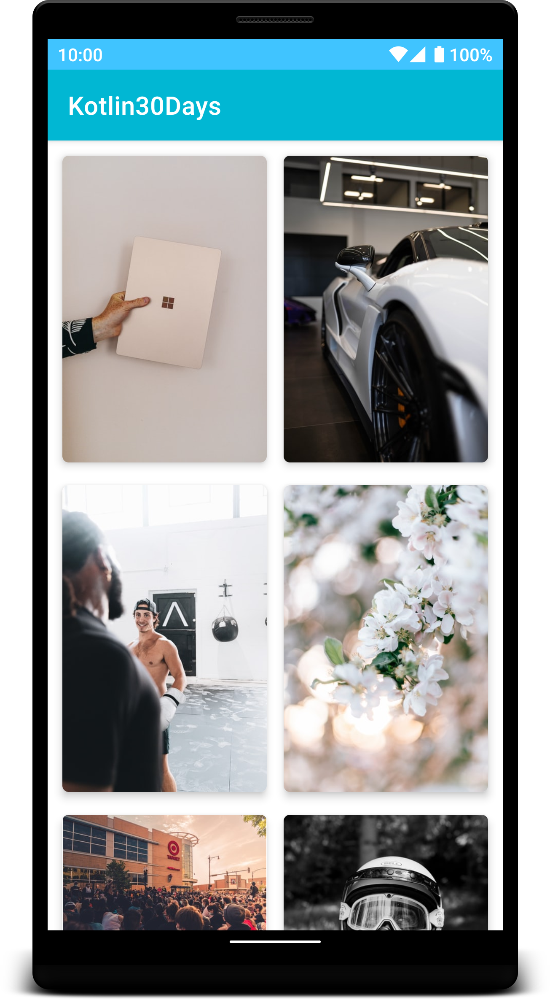
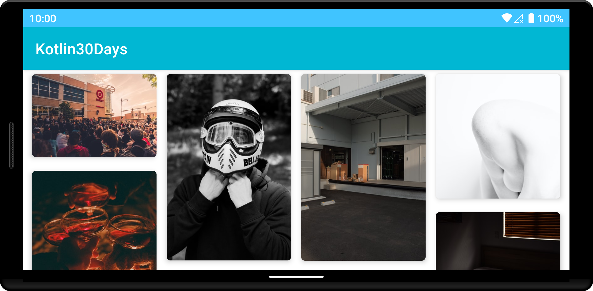

# Kotlin30days  
30 Days of Kotlin with Google Developers

30 Days of Kotlin with Google Developers is an initiative to improve your understanding of Kotlin and apply it in real projects using Google resources (codelabs, sessions with Googlers) between 7th May - 7th of June.

# **Project Submission**

Congratulations on learning more Kotlin! Whether it was through Codelabs, articles, videos, or courses, we hope that you found the content helpful in advancing your skills. Now use what you learned by applying it to a project. Feel free to come up with your own project idea. Be sure your project meets the following guidelines :

-   Use Kotlin as primary language of the app.
-   Implement at least 3 Kotlin concepts that you recently learned. In the application submission process, you will describe which concepts you picked and how you incorporated them.
-   Can use Android Studio to build an Android app or can use IntelliJ to build a Kotlin program.
-   Project should have been built during this month.
-   Code should be open sourced on GitHub as a public repository.
-   One individual can submit one application only!

## Kotlin App - Kotlin30Days
  
A sample Android application written in Kotlin to fetch images from Unsplash API with Pagination and demonstrates the use of Coil (for image loading), Koin (for injecting dependencies), Retrofit, Coroutines and MVVM  

***Submission Criteria Todo:***
-   Use Kotlin as primary language of the app.  :heavy_check_mark:
-   Implement at least 3 Kotlin concepts that you recently learned. In the application submission process, you will describe which concepts you picked and how you incorporated them
	- Coroutines  :heavy_check_mark:
	-  Lambdas :heavy_check_mark:
	- Top-level function :heavy_check_mark:
	- MVVM  :heavy_check_mark:
	- Koin  :heavy_check_mark:
	- Retrofit  :heavy_check_mark:
-   Can use Android Studio to build an Android app or can use IntelliJ to build a Kotlin program. 
	 - Android Studio to build an Android app :heavy_check_mark:
-   Project should have been built during this month. :heavy_check_mark:
-   Code should be open sourced on GitHub as a public repository. :heavy_check_mark:
-   One individual can submit one application only! :heavy_check_mark:
 
 
  
  
## Getting Started  
  
To setup this project, just clone it first. Then obtain the API key from <a href="https://unsplash.com/documentation">here</a>. Put this key in `gradle.property` file's appropriate `API_KEY` field and run the application. That's all!  
  
## Architecture  
  
This application uses MVVM (Model-View-ViewModel) Architecture which is Google's recommended architecture for Android apps. You can read more about MVVM <a href="https://developer.android.com/jetpack/docs/guide#recommended-app-arch">here</a>.  

  
 
 